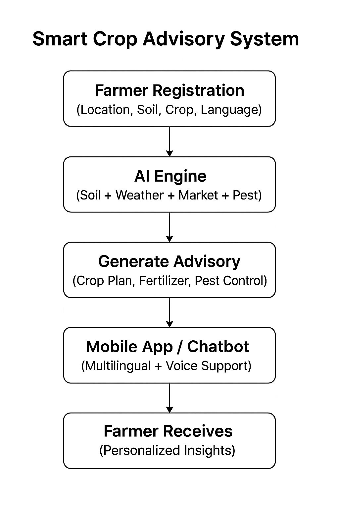

# Smart India Hackathon Workshop
# Date:29/09/2025
## Register Number:25017693
## Name:Jaya Surya R
## Problem Title
SIH 25010: Smart Crop Advisory System for Small and Marginal Farmers
## Problem Description
A majority of small and marginal farmers in India rely on traditional knowledge, local shopkeepers, or guesswork for crop selection, pest control, and fertilizer use. They lack access to personalized, real-time advisory services that account for soil type, weather conditions, and crop history. This often leads to poor yield, excessive input costs, and environmental degradation due to overuse of chemicals. Language barriers, low digital literacy, and absence of localized tools further limit their access to modern agri-tech resources.

Impact / Why this problem needs to be solved

Helping small farmers make informed decisions can significantly increase productivity, reduce costs, and improve livelihoods. It also contributes to sustainable farming practices, food security, and environmental conservation. A smart advisory solution can empower farmers with scientific insights in their native language and reduce dependency on unreliable third-party advice.

Expected Outcomes

• A multilingual, AI-based mobile app or chatbot that provides real-time, location-specific crop advisory.
• Soil health recommendations and fertilizer guidance.
• Weather-based alerts and predictive insights.
• Pest/disease detection via image uploads.
• Market price tracking.
• Voice support for low-literate users.
• Feedback and usage data collection for continuous improvement.

Relevant Stakeholders / Beneficiaries

• Small and marginal farmers
• Agricultural extension officers
• Government agriculture departments
• NGOs and cooperatives
• Agri-tech startups

Supporting Data

• 86% of Indian farmers are small or marginal (NABARD Report, 2022).
• Studies show ICT-based advisories can increase crop yield by 20–30%.

## Problem Creater's Organization
Government of Punjab

## Theme
Agriculture, FoodTech & Rural Development

## Proposed Solution
```
The proposed solution is a multilingual, AI-powered mobile application and chatbot designed specifically for small and marginal farmers. It will provide personalized, real-time crop advisory services by integrating data on soil health, weather forecasts, crop history, and pest/disease patterns. The app will support voice commands and responses in local languages to overcome literacy barriers. Farmers can upload images of crops to detect pests or diseases using AI-based image recognition. Additionally, the app will offer market price tracking to help farmers make informed selling decisions. Continuous feedback and usage data will be collected to improve the system’s accuracy and relevance over time.

How it addresses the problem:

Provides scientific, location-specific advice replacing guesswork and unreliable sources.
Supports multiple languages and voice interaction to overcome literacy and language barriers.
Uses AI and data analytics for predictive insights and pest detection.
Integrates weather and market data for comprehensive decision support.
Empowers farmers to optimize input use, reduce costs, and increase yields sustainably.
Innovation and uniqueness:

Combines multiple data sources (soil, weather, market, pest images) into a single platform.
AI-driven pest/disease detection via image uploads is tailored for local crop varieties.
Voice-enabled interface for accessibility to low-literate users.
Real-time, location-specific advisories rather than generic recommendations.

## Technical Approach
Technologies to be used:

Mobile app development: Flutter or React Native for cross-platform support.
Backend: Python (Django/Flask) or Node.js for API services.
AI/ML: TensorFlow/PyTorch for pest/disease image recognition and predictive analytics.
Cloud services: AWS/GCP/Azure for scalable data storage and processing.
Natural Language Processing (NLP): Google Dialogflow or Rasa for multilingual chatbot and voice support.
Weather and market data APIs integration.
Methodology and process:

Data collection from soil sensors, weather stations, and market databases.
Development of AI models for pest/disease detection using labeled image datasets.
Design of multilingual voice-enabled chatbot interface.
Integration of advisory algorithms based on agronomic best practices.
Pilot testing with small farmer groups for feedback and iterative improvement.
Deployment and continuous monitoring with feedback loops.
```


## Feasibility and Viability
```
Feasibility:

Availability of open-source AI frameworks and cloud infrastructure reduces development cost.
Increasing smartphone penetration and mobile internet access in rural India supports adoption.
Existing datasets and partnerships with agricultural institutions facilitate model training and validation.
Potential challenges and risks:

Digital literacy and smartphone access may still be limited for some farmers.
Variability in local dialects and languages could complicate voice interface design.
Data privacy and security concerns.
Accuracy of AI models in diverse agro-climatic zones.
Strategies to overcome challenges:

Incorporate voice and offline modes to enhance accessibility.
Collaborate with local language experts and community workers for localization.
Implement strong data protection policies and transparent user consent.
Continuous model retraining with local data and farmer feedback.
```
## Impact and Benefits
```
Potential impact:

Increased crop yields by 20–30% through optimized input use and timely interventions.
Reduced input costs and environmental impact by minimizing overuse of fertilizers and pesticides.
Enhanced farmer income and livelihood security.
Strengthened food security and sustainable agricultural practices in rural India.
Benefits:

Social: Empowers marginalized farmers with knowledge and technology.
Economic: Improves profitability and market access.
Environmental: Promotes sustainable farming and reduces chemical runoff.
```

## Research and References
```
NABARD Report, 2022: Statistics on small and marginal farmers in India.
Studies on ICT-based agricultural advisories increasing crop yield by 20–30%.
Research papers on AI-based pest and disease detection in crops.
Government of Punjab agricultural data and extension service reports.
Relevant open-source AI and NLP frameworks documentation.
```
## Flow chart

